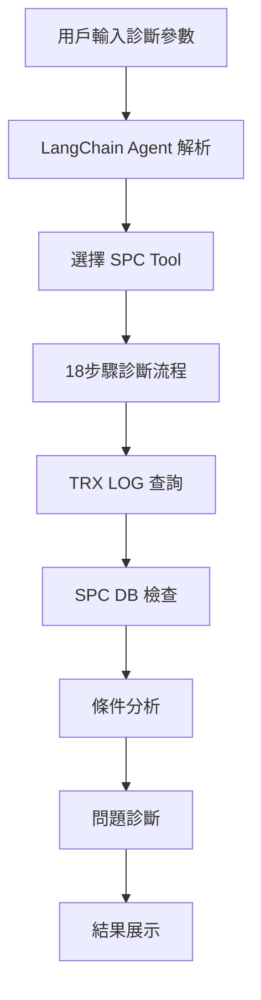
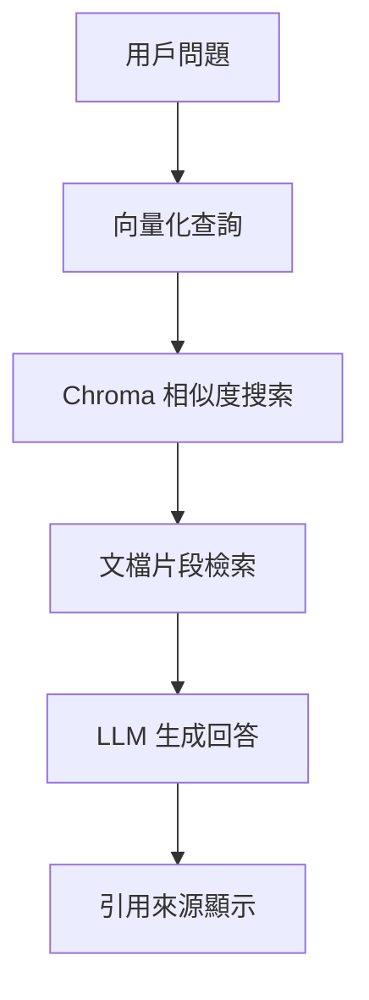

# RAG_AGENT_LLM 專案架構文件

## 📋 專案概述

**RAG_AGENT_LLM** 是一個基於大型語言模型的企業級智能助手系統，專門設計用於半導體製造業的 SPC (Statistical Process Control) 系統診斷和文檔檢索。

## 🏗️ 整體架構

```
RAG_AGENT_LLM/
├── 🎯 前端層 (Frontend Layer)
│   ├── Streamlit Web UI
│   └── 用戶交互界面
│
├── 🤖 代理層 (Agent Layer)
│   ├── LangChain Agent (智能任務規劃)
│   └── Tool Manager (工具協調)
│
├── 🛠️ 工具層 (Tools Layer)
│   ├── SPC 診斷工具
│   ├── 文檔檢索工具
│   └── 資料庫查詢工具
│
├── 🔌 API 層 (API Layer)
│   ├── 通用查詢 API
│   ├── TRX LOG API
│   └── 文檔檢索 API
│
└── 💾 數據層 (Data Layer)
    ├── 向量數據庫 (Chroma)
    ├── MES 資料庫
    └── SPC 資料庫
```

## 📁 目錄結構詳解

### 🎯 **前端層 (/frontend/)**

```python
frontend/
├── main.py                 # 主應用入口
├── ui_helpers.py          # UI 輔助函數和組件
├── llm_handler.py         # LLM 處理邏輯
└── config/                # 前端配置
```

**技術棧**：
- **Streamlit**: Web UI 框架
- **自定義組件**: 聊天界面、文檔顯示、表格渲染

**核心功能**：
- 多模態聊天界面 (文字、圖片、文檔)
- 智能 XML 內容檢測與格式化
- Markdown 表格渲染
- 實時對話流管理

### 🤖 **代理層 (/agents/)**

```python
agents/
├── langchain_agent.py     # LangChain 智能代理
└── base_agent.py          # 代理基類
```

**技術棧**：
- **LangChain**: Agent 框架
- **ReAct Pattern**: Thought/Action/Observation 循環
- **ChatOpenAI**: GPT 模型整合

**核心功能**：
- 自動任務規劃與分解
- 智能工具選擇與組合
- 多輪對話上下文管理
- 錯誤處理與重試機制

### 🛠️ **工具層 (/tools/)**

```python
tools/
├── tool_manager.py                 # 工具管理器
├── base_tool.py                   # 工具基類
├── spc_tool.py                    # SPC 診斷工具 ⭐
├── spc_detail_viewer_tool.py      # SPC 詳細查看工具
├── document_retrieval_tool.py     # 文檔檢索工具
├── database_query_tool.py         # 資料庫查詢工具
└── vector_search_tool.py          # 向量搜索工具
```

#### 🌟 **SPC 診斷工具詳解**

**功能特色**：
- 18步驟完整診斷流程
- TRX LOG 自動查詢與分析
- Chart_Condition 智能解析
- 多廠別支援 (TFT6/CF6/LCD6/USL)

**診斷流程**：
1. **參數提取**: 廠別、時間、玻璃ID、設備ID、CHART ID
2. **TRX LOG 查詢**: 3階段查詢策略
3. **SPC 資料庫檢查**: 進CHART狀態驗證
4. **條件分析**: Chart_Condition 解析與比對
5. **DATA_GROUP 驗證**: MES DB 與 TRX LOG 比對
6. **問題診斷**: 綜合分析與建議

### 🔌 **API 層 (/apis/)**

```python
apis/
├── universal_query_api.py         # 通用查詢 API
├── trx_log_api.py                # TRX LOG API
├── document_retrieval_api.py      # 文檔檢索 API
└── vector_search_api.py           # 向量搜索 API
```

**設計模式**：
- RESTful API 設計
- 統一錯誤處理
- 連接池管理
- SQL 注入防護

### 💾 **數據存儲**

```python
data/
├── vector_db/             # Chroma 向量數據庫
├── documents/            # 原始文檔存儲
└── cache/               # 緩存文件
```

**存儲策略**：
- **向量數據庫**: 文檔語義搜索
- **關係數據庫**: 結構化數據查詢
- **文件存儲**: 原始文檔保存
- **內存緩存**: 熱數據快取

## 🔄 工作流程

### 典型 SPC 診斷流程



### RAG 文檔檢索流程



## 🎯 核心特性

### ✨ **智能化能力**

1. **自動任務規劃**: LangChain Agent 自動分解複雜任務
2. **智能工具選擇**: 根據問題類型自動選擇合適工具
3. **上下文理解**: 多輪對話上下文維護
4. **錯誤自愈**: 自動重試與錯誤處理機制

### 🔒 **企業級特性**

1. **安全防護**: 
   - SQL 注入防護
   - 輸入驗證與清理
   - 安全標識符檢查

2. **性能優化**:
   - 連接池管理
   - 查詢結果緩存
   - 異步處理支援

3. **可擴展性**:
   - 模組化工具設計
   - 統一 API 接口
   - 配置驅動架構

### 📊 **SPC 專業能力**

1. **多廠別支援**: TFT6、CF6、LCD6、USL
2. **完整診斷**: 18步驟標準化流程
3. **智能分析**: Chart_Condition 自動解析
4. **問題定位**: 精準的原因分析

## 🛠️ 技術棧

### 後端技術
- **Python 3.11+**: 主要開發語言
- **LangChain**: Agent 框架與 LLM 整合
- **OpenAI GPT**: 大型語言模型
- **Chroma**: 向量數據庫
- **Requests**: HTTP 客戶端

### 前端技術
- **Streamlit**: Web UI 框架
- **Markdown**: 內容格式化
- **Custom Components**: 自定義 UI 組件

### 數據技術
- **Oracle/SQL Server**: 企業數據庫
- **Vector Embeddings**: 語義搜索
- **RESTful APIs**: 服務整合

## 🚀 部署架構

```
Production Environment
├── Web Server (Streamlit)
├── Application Server (Python)
├── Vector Database (Chroma)
├── Enterprise Databases
│   ├── MES Database
│   └── SPC Database
└── External APIs
    └── TRX LOG API
```

## 📈 使用場景

### 主要應用場景

1. **SPC 系統診斷**:
   - 玻璃進CHART狀態檢查
   - 條件不符原因分析
   - DATA_GROUP 設定驗證

2. **技術文檔檢索**:
   - 智能問答系統
   - 文檔相似度搜索
   - 引用來源追蹤

3. **數據查詢分析**:
   - 跨系統數據整合
   - 複雜 SQL 查詢簡化
   - 結果可視化展示

## 🔮 未來發展

### 計劃擴展功能

1. **多模態支援**: 圖像識別與分析
2. **實時監控**: 即時系統狀態監控
3. **預測分析**: 基於歷史數據的預測模型
4. **工作流自動化**: 端到端流程自動化

---

**架構設計原則**: 模組化、可擴展、安全可靠、用戶友好

**維護團隊**: GitHub Copilot 輔助開發

**最後更新**: 2025年9月4日